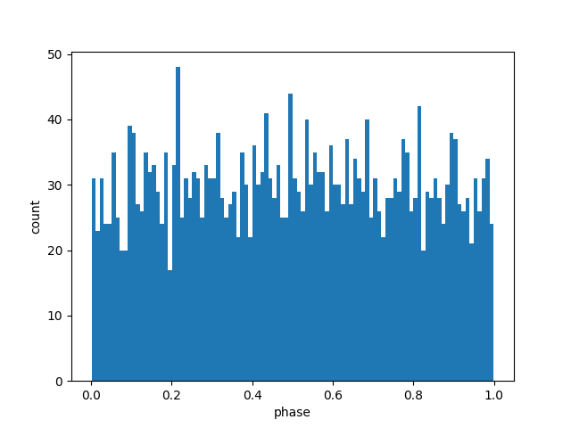
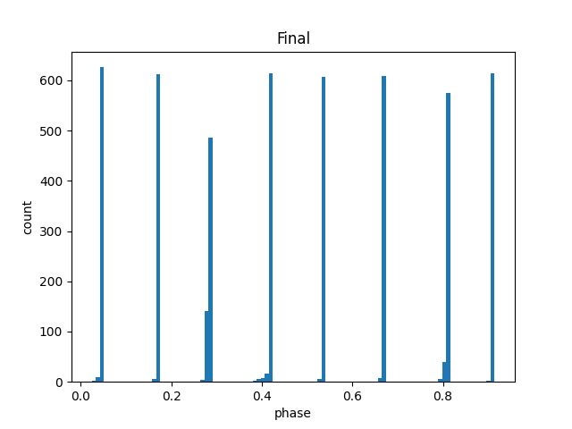

# Cell Cycle Feedback Model Implemented in Mojo
This is a numerical simulation of a cell cycle synchronization model from [this paper](https://pubmed.ncbi.nlm.nih.gov/24816612/) implemented in mojo mostly as a learning exercise.

The model shows that when cells impede the progress of younger cells, the distribution of cell age shows two or more spikes (clustering) instead of a single spike (synchronization) or uniform distriubtion.

# Example
The following histograms show cell phase distribution before and after 300 cell cycles

